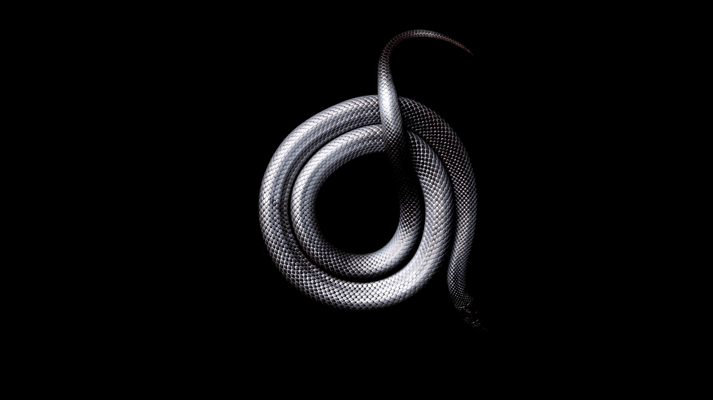

# Welcome to my website!


This is much more fun than facebook and instagram....

But while I was on reddit I read about `steganography`, and it seems like a pretty interesting topic :D

So... here is what it is (according to wikipedia at least):

<br/>
## Steganography:

```
Steganography is the practice of concealing a file, message, image, or video within another file, message, image, or video. The word steganography comes from Greek steganographia, which combines the words steganós, meaning "covered or concealed", and -graphia meaning "writing".
```

So I tried it out and here is the output after I was done! can you guess the secret?



Have fun solving it! Here's some music to listen to while you're trying to solve it! Rock on \m/

<iframe src="https://open.spotify.com/embed/playlist/45Y6fyltLz8KKvD2XHXw4j" width="100%" height="380" frameborder="0" allowtransparency="true" allow="encrypted-media"></iframe>

<br/>
## Vacation Mode is still going strong!

I am still on vacation while I'm doing all this, which is so much fun to be honest, but there is always time to go do some sightseeing to take some photos!


